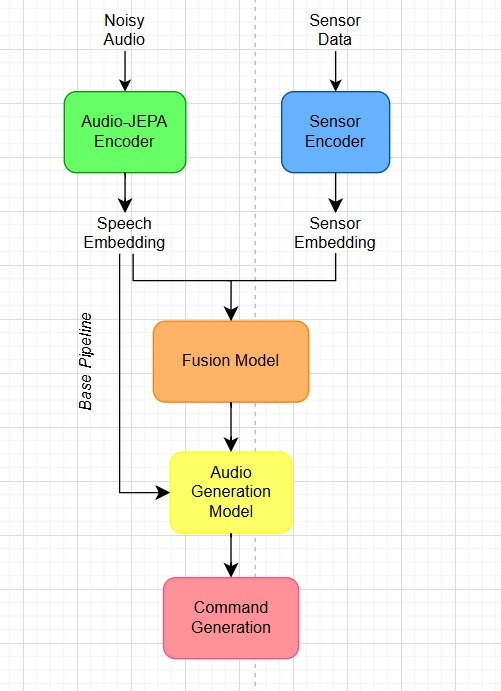

# Robust Safety Command Inference via Uncertainty-Aware Multimodal Fusion

Project repository for the hackathon submission: robustly inferring short safety commands in extremely noisy industrial environments by fusing noisy speech and industrial sensor data, and reporting a reliability score with generated clear alerts.

**Short description**: When speech is too degraded by industrial noise, infer a worker's intended safety command using multimodal context (audio + sensors) and produce a clear alert plus a confidence score.

**Status**: Concept / prototype-ready. This README answers mentor questions, documents dataset strategy, model ideas, evaluation plans, and integration considerations.

**Table of contents**
- **Overview**: high-level motivation and goals
- **Generative AI**: where generative models fit
- **Dataset & Synthetic Construction**: datasets, mixing, alignment, realism
- **Model Design & Baselines**: encoders, fusion, uncertainty methods
- **Evaluation & Metrics**: what to measure and how
- **Integration**: real-world sync and deployment notes
- **Experiments & Reproducibility**: suggested repo structure and commands
- **Open Questions for Mentor**: targeted asks for guidance

**Overview**
- **Problem**: In industrial settings (100+dB background), speech may be unrecoverable; relying on ASR alone risks missed or incorrect safety commands.
- **Goal**: Use multimodal inputs — noisy short audio commands + time-series sensor data (temperature, vibration, pressure, machine states) — to infer the intended safety command and a reliability score, and generate a clear alert.
- **High-level approach**: 1) learn robust speech representations (self-supervised / masked predictive learning); 2) encode sensor time-series; 3) fuse modalities with an uncertainty-aware mechanism; 4) output command + reliability and optionally synthesize a spoken alert.

## Architecture



**Generative AI Application**
- **Representation learning**: Use self-supervised / generative representation learning on raw audio (masked predictive objectives). Models/ideas: `wav2vec 2.0`, `HuBERT`, CPC, or research-style masked predictive encoders inspired by AJEPA. These learn features that are robust to corruption/noise.
- **Alert synthesis**: For final user-facing alerts, use deterministic templated messages (recommended for safety) and optionally a neural TTS (e.g., Tacotron2 + HiFi-GAN or cloud TTS) if a synthetic voice is required.
- **Recommendation**: Prioritize robust representation and uncertainty-aware classification first. Use simple templated text-to-speech for the demo; avoid generative paraphrasing for safety-critical wording.

**Dataset & Synthetic Construction**
Datasets to combine (proposed):
- **Speech**: Google Speech Commands (short command set) — source of clean utterances.
- **Noise**: ESC-50 environmental sounds — used to simulate industrial background; augment with simulated reverberation and overlapping sources.
- **Sensors**: SKAB (Skoltech Anomaly Benchmark) — time-series sensor patterns to represent machine states/anomalies.

- **Mixing strategy (practical pipeline)**:
  - **Step 1**: Choose a speech command (clean clip).
  - **Step 2**: Choose a sensor segment representing a machine state (normal / anomaly). Attach metadata label for the intended command (map sensor pattern -> likely command).
  - **Step 3**: Sample ESC-50 noise clips and mix into the speech at target SNRs (e.g., 0, -5, -10 dB), and apply random reverberation and clipping to increase realism.
  - **Step 4**: Align audio and sensor windows by pairing: generate timestamps and set a relative offset policy (e.g., sensor window centered around command timestamp). For event-driven commands (e.g., emergency stop), inject sensor anomalies aligned to the command timestamp to simulate causality.

- **Alignment tips**:
  - Use a consistent timeline with millisecond timestamps for both sensor and audio (store as `start_time` + sampling rates)
  - If sensor sampling rates differ, resample or window sensors to fixed-length segments (e.g., 1–5 s) surrounding the command
  - For synthetic scenarios, inject events into the sensor stream at known times and place the audio command at the same or nearby times

- **Quality & realism best practices**:
  - Randomize SNRs and reverberation, include silent segments and overlapping noises
  - Model distribution shifts: include different noise types, gain variations, sensor drifts, missing channels
  - Validate realism with domain experts or by comparing simple statistics (SNR distribution, sensor feature distributions) to real industrial logs if available
  - Keep an explicit `metadata.csv` with `audio_file`, `sensor_file`, `snr`, `command_label`, `timestamp`, `scenario_type` for reproducibility

**Model Design & Baselines**
- **Speech encoder (robust)**: fine-tune or train a small self-supervised encoder (wav2vec 2.0 / HuBERT / CPC). Alternatively, use log-mel frontend + robust CNN/Transformer.
- **Sensor encoder**: TCN, 1D-CNN, or small Transformer over raw sensor time-series (with normalization per channel).
- **Fusion strategies**:
  - **Late fusion**: independent modality classifiers + combine via weighted averaging with learned reliability weights
  - **Early / cross-attention fusion**: cross-modal Transformer layers or cross-attention to let sensors influence audio representation (recommended for expressive interactions)
  - **Uncertainty-aware gating**: learn per-modality confidences (using auxiliary heads that predict uncertainty) and apply soft gating on logits.

- **Uncertainty estimation methods**:
  - **Aleatoric uncertainty**: model outputs an uncertainty parameter (e.g., heteroscedastic loss)
  - **Epistemic uncertainty**: deep ensembles or MC Dropout (for approximate Bayesian behavior)
  - **Evidential learning**: produce Dirichlet parameters for classification and derive confidence
  - **Calibration**: temperature scaling, reliability diagrams, Expected Calibration Error (ECE)

- **Baselines**:
  - `ASR-only` pipeline (speech enhancement -> ASR -> map transcript -> command)
  - `Sensor-only` classifier
  - `Naive concat` (concatenate embeddings and classify)
  - `Oracle-clean` (speech with no noise) as an upper bound

**Evaluation & Metrics**
- **Classification metrics**: accuracy, precision/recall, F1 per command class
- **Safety metrics**: false accept (incorrect safety action) and false reject (missed safety command) rates — weight false accepts more heavily if they trigger risky actions
- **Calibration & reliability**: ECE, reliability diagrams, negative log-likelihood (NLL)
- **Robustness tests**: performance versus SNR, unseen noise types, sensor channel dropouts, time offset between modalities
- **Operational metrics**: latency (ms), memory footprint for target deployment

**Integration with Industrial Systems**
- **Synchronization**: use common timestamps (NTP or PTP) or embed monotonic counters; sample and store fixed-length windows around events
- **Streaming vs event-driven**: for low-latency, stream audio/sensor windows and run a sliding-window inference; for simplicity, start with event-triggered processing (voice activity detection or operator button press)
- **System interfaces**: publish alerts via MQTT/OPC-UA/HTTP; log events with `command`, `confidence`, `timestamp`, `sensor_snapshot`
- **Safety note**: prefer conservative actions on low confidence (e.g., request manual confirmation, or a non-invasive alert). Avoid automatic machine shutdown unless human-in-the-loop or proven safe.

**Experiments & Reproducibility (repo suggestions)**
- **Suggested repo layout** (not yet implemented):
  - `data/` – dataset builders & mixing scripts (`create_synthetic.py`)
  - `models/` – model definitions and training utilities
  - `train.py`, `evaluate.py`, `predict.py`
  - `notebooks/` – exploratory analysis and visualizations
  - `resources/` – references and dataset pointers

- **Example commands** (once scripts exist):
```
# create mixed dataset (audio + sensors)
python data/create_synthetic.py --speech_dir data/google_speech_commands --noise_dir data/esc50 --sensor_dir data/skab --out data/synthetic --snr_levels 20,10,0,-5,-10

# train a multimodal model
python train.py --config configs/multimodal_fusion.yaml

# evaluate model and compute calibration
python evaluate.py --checkpoint outputs/best.pt --test data/synthetic/test
```
